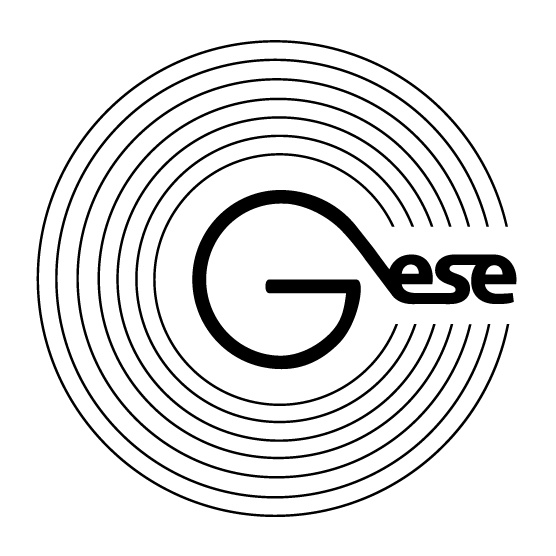

# Gese Token smart contract

* _Standard_        : [ERC20](https://github.com/ethereum/EIPs/blob/master/EIPS/eip-20.md)
* _[Name](https://github.com/ethereum/EIPs/blob/master/EIPS/eip-20.md#name)_            : Gese 
* _[Ticker](https://github.com/ethereum/EIPs/blob/master/EIPS/eip-20.md#symbol)_          : GSE
* _[Decimals](https://github.com/ethereum/EIPs/blob/master/EIPS/eip-20.md#decimals)_        : 18
* _Emission_        : Mintable
* _Crowdsales_      : 2
* _Fiat dependency_ : No
* _Tokens locked_   : Yes

## Smart-contracts description

The tokens for the bounty and the team are minted after the ICO  is finished.  
There is a special function to return 3rd party tokens that were sent by mistake (function retrieveTokens()).  
Each stage has a direct minting function in wei. This is made to support the external payment gateways.

### Contracts contains
1. _GeseToken_ - Token contract
2. _PreITO_ - PreITO contract
3. _ITO_ - ITO contract
4. _Configurator_ - contract with main configuration for production
5. _TokenDistributor_ - airdrop support contract

### How to manage contract
To start working with contract you should follow next steps:
1. Compile it in Remix with enamble optimization flag and compiler 0.4.18
2. Deploy bytecode with MyEtherWallet. Gas 5100000 (actually 5073514).
3. Call 'deploy' function on addres from (3). Gas 4000000 (actually 3979551). 

Contract manager must call finishMinting after each crowdsale milestone!
To support external mint service manager should specify address by calling _setDirectMintAgent_. After that specified address can direct mint tokens by calling _mintTokensByETHExternal_ and _mintTokensExternal_.

### How to invest
To purchase tokens investor should send ETH (more than minimum 0.1 ETH) to corresponding crowdsale contract.
Recommended GAS: 250000, GAS PRICE - 21 Gwei.

### Wallets with ERC20 support
1. MyEtherWallet - https://www.myetherwallet.com/
2. Parity 
3. Mist/Ethereum wallet

EXODUS not support ERC20, but have way to export key into MyEtherWallet - http://support.exodus.io/article/128-how-do-i-receive-unsupported-erc20-tokens

Investor must not use other wallets, coinmarkets or stocks. Can lose money.

## Tokens distribution

* _Bounty tokens percent_       : 5%
* _Advisors_                    : 10%
* _Team tokens percent_         : 10%
* _Reserved tokens percent_     : 10%
* _For sale tokens percent_     : 65%

## AirDrop feature
* Contains airdrop support contracts

## Main network configuration

* _Bounty tokens wallet_        : 
* _Advisors tokens wallet_      : 
* _Team tokens wallet_          :
* _Reserved tokens wallet_      : 
* _Contracts manager_           :

### Links
1. _Token_ - https://etherscan.io/token/0x981c00655758fe2b2d6b070718a6d9e6d71a30b6
2. _PreITO_ - https://etherscan.io/address/0x1998b337ca479a623299a76bdafdf75b41070b79
3. _ITO_ - https://etherscan.io/address/0xae68a9a9d2cb999b5392bea198147127bd3a6d33

### Features
* Manually mint tokens by owner or sale agent at any time until token minting finished. 
* Manually mint tokens in ether value by owner or sale agent at corresponding sale contract during current sale processing.  
* 5% referal system  

### Crowdsale stages

#### PreITO
* _Minimal insvested limit_     : 0.1 ETH
* _Base price_                  : 1 ETH = 7867 Tokens
* _Hardcap_                     : 3818 ETH
* _Softcap_                     : 3640 ETH
* _Period_                      : 15 days
* _Start_                       : 15 May 2018 00:00:00 GMT
* _Wallet_                      : 

#### ITO
* _Minimal insvested limit_     : 0.1 ETH
* _Base price_                  : 1 ETH = 5500 Tokens
* _Hardcap_                     : 49 090 ETH
* _Start_                       : 01 Jul 2018 00:00:00 GMT
* _Wallet_                      : 
 
##### Milestones
1. 5 days, bonus +33%
2. 5 days, bonus +18%
3. 5 days, bonus +11% 
4. 5 days, bonus +5% 
5. 10 without bonus 

## Ropsten network configuration 

### Links
1. _Token_ - https://ropsten.etherscan.io/address/0x7d764b0ae0e98f661ea42d78e0e6ecc125a2597d
2. _PreITO_ - https://ropsten.etherscan.io/address/0xaa6593aad0af2a4493b82aa5ef3d2ecfbeec46cf
3. _ITO_ - https://ropsten.etherscan.io/address/0xae6d324a9b0c6d04ed18c1ca17a1d929e9827d31
4. _Token Distributor_ - https://ropsten.etherscan.io/address/0x18c32fe27cf805c4058e2f2b7eb64e28736245a6

### Crowdsale stages

#### PreITO

* _Minimal insvested limit_     : 0.1 ETH
* _Base price_                  : 1 ETH = 7867 Tokens
* _Hardcap_                     : 3 ETH
* _Softcap_                     : 1.5 ETH
* _Period_                      : 15 days
* _Start_                       : 29 Mar 2018 00:00:00 GMT
* _Wallet_                      : 0x8fd94be56237ea9d854b23b78615775121dd1e82

##### Purchasers

* 1 ETH => 7,867 tokens, gas = 129031
https://ropsten.etherscan.io/tx/0x3bb726d3d8eb03b5b370d812109d10ffd61251bfa89a85d0fbfc7bf3b027cc18

* 0.01 ETH => rejected txn, less then mininal investment limit, gas = 21303
https://ropsten.etherscan.io/tx/0xd272e70988f6b52fe33bf6a6f5e2fad73538334cb2d914b9aa1962916bc078ca

* 2 ETH => 15,734 tokens + 786.7 tokens to referer (5% bonus), gas = 143055
https://ropsten.etherscan.io/tx/0x40f5663a4cd22adb3aa6da4f5dc7a0e0d5ae892fb027ad33f548f6cbbf1446ae

* 1 ETH => rejected txn, hardcap is reached, gas = 22590
https://ropsten.etherscan.io/tx/0x81f695de2f7f4b817ee3091ab59820be98d59ddc9dbfb6c52c381f77e1eb2630

##### Service operations

* finish, gas = 39700
https://ropsten.etherscan.io/tx/0xd1e8f7a3d9320bc6d67c96b80792c96f958f8f57ce9fb90c51ce4b682ea57680

#### ITO

* _Minimal insvested limit_     : 0.1 ETH
* _Base price_                  : 1 ETH = 5500 Tokens
* _Hardcap_                     : 49 090 ETH
* _Start_                       : 29 Mar 2018 00:00:00 GMT
* _Wallet_                      : 0x8fd94be56237ea9d854b23b78615775121dd1e82
* _Bounty tokens wallet_        : 0x8Ba7Aa817e5E0cB27D9c146A452Ea8273f8EFF29
* _Advisors tokens wallet_      : 0x24a7774d0eba02846580A214eeca955214cA776C
* _Team tokens wallet_          : 0xaa8ed6878a202eF6aFC518a64D2ccB8D73f1f2Ca
* _Reserved tokens wallet_      : 0x470a2D1105EaE6aAe879623357F615Ab9cbf906E
* _Bounty tokens percent_       : 5%
* _Advisors_                    : 10%
* _Team tokens percent_         : 10%
* _Reserved tokens percent_     : 10%

_Milestones_

1. 5 days, bonus +33%
2. 5 days, bonus +18%
3. 5 days, bonus +11% 
4. 5 days, bonus +5% 
5. 10 without bonus 

##### Purchasers

* 1 ETH => 7,315 tokens (33% bonus), gas = 88124
https://ropsten.etherscan.io/tx/0xfc11dc70d73ae1d8763abf1ea14938edf60e500cd371b836df4257cec76e0f95

* 1 ETH =>  6,490 tokens (18% bonus) + 324.5 tokens to referer (5% bonus), gas = 113357
https://ropsten.etherscan.io/tx/0x8688f10f397d9eb61c0e8878a2261d80cc45803fc8d6b688c0b66ed8e9ed37f3

* 1 ETH => rejected txn, ITO is finished, gas = 42934
https://ropsten.etherscan.io/tx/0xf6f55be56ba636d99df3a6c9c5baf5310bd72bf6278d1401ea12d9b19cd99d85

##### Service operations

* setStart, gas = 28198
https://ropsten.etherscan.io/tx/0xf8e203e184a7c4affd202055e18fcdf58ce0fd6c4f300f9df2f403364ceb219c

* finish, gas = 230389
https://ropsten.etherscan.io/tx/0xa3ad5439bfe61209ae50feb41ce4d26308369d49cd65b1273471352fb8e8c589

### Token Distributor

* addReceivers, gas = 92239
https://ropsten.etherscan.io/tx/0xd56ec9e2cc263d546ead25a3d99552596e3ce28171e9c08baf901405a285b198

### Token holders
https://ropsten.etherscan.io/token/0x7d764b0ae0e98f661ea42d78e0e6ecc125a2597d#balances
