# User's Manual

## Which wallets you can use to buy tokens
Tokens can be bought from wallets that support the standard ERC20.
The most common wallets are:
* MyEtherWallet
* Ethereum Wallet / Mist
* Parity

Do not buy tokens directly from stock exchanges or exchangers!

## Creating a wallet
To participate in the sale you will need an ethereum wallet supporting ERC20.
If you do not already have one, we recommend using https://www.myetherwallet.com.

1. Go to https://www.myetherwallet.com
  

Screenshot

  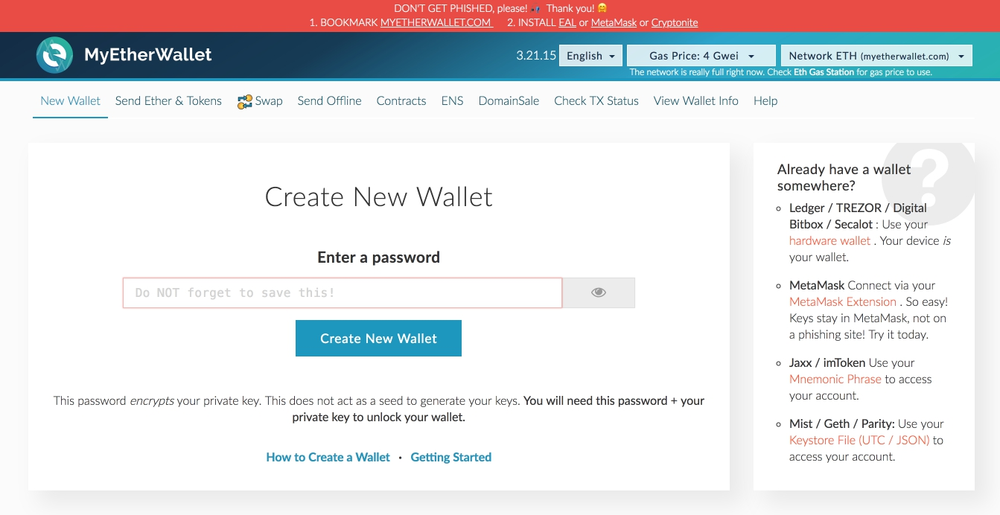

  
 

2. Enter a strong but easy to remember password. Do not forget it. Click the "Create New Wallet"
  

Screenshot

  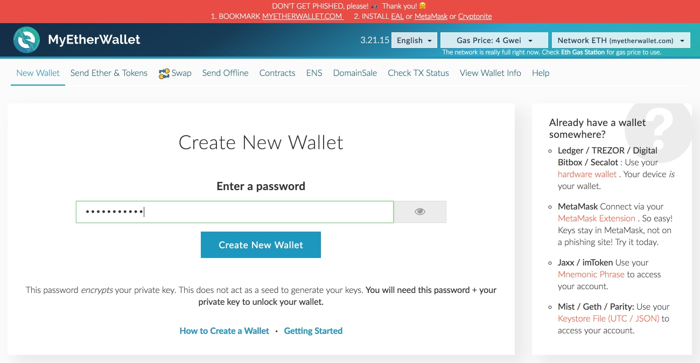

  
 

3. Download your Keystore file & save this file to a USB drive.  
Read the warning. If you understand it, click the "I understand. Continue" button.
  

Screenshot

  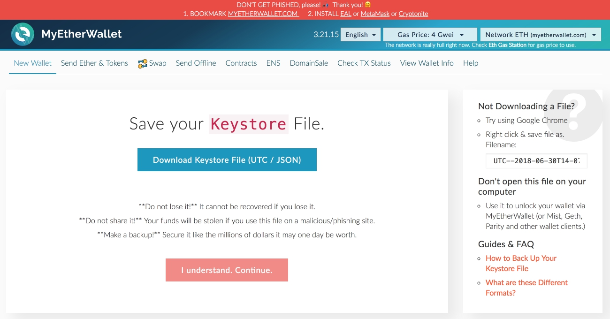

  
 

4. Print your paper wallet backup and/or carefully hand-write the private key on a piece of paper. Copy & paste your address into a text document somewhere.
  

Screenshot

  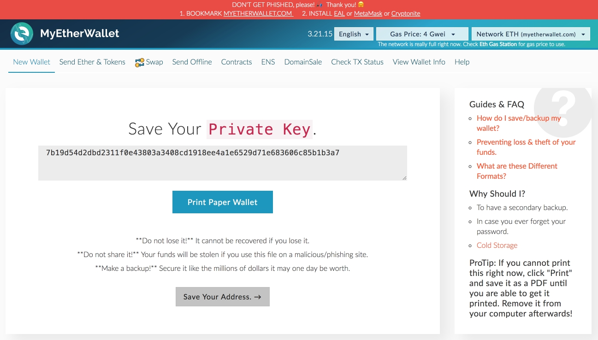

  
 

5. Click "View Wallet Info" to see information about your wallet.
  

Screenshot

  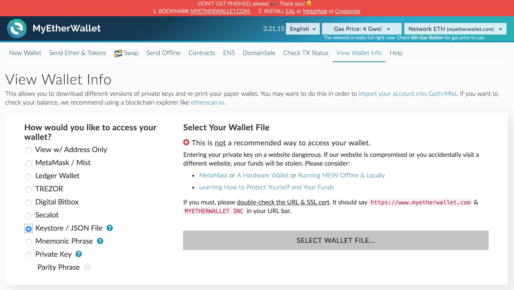

  
 

6. Click "Select wallet file", select Keystore file, enter password. Then click "Unlock".
  

Screenshot

  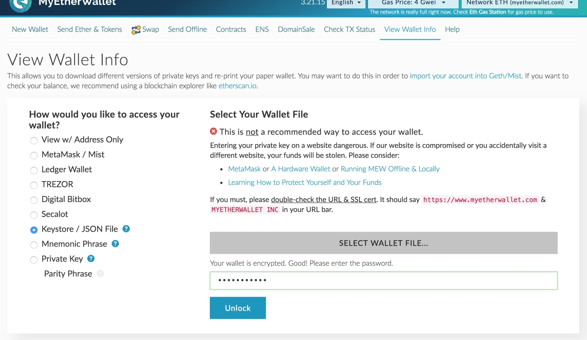

  
 

7. The address of your wallet will be displayed in the field "Your address"
  

Screenshot

  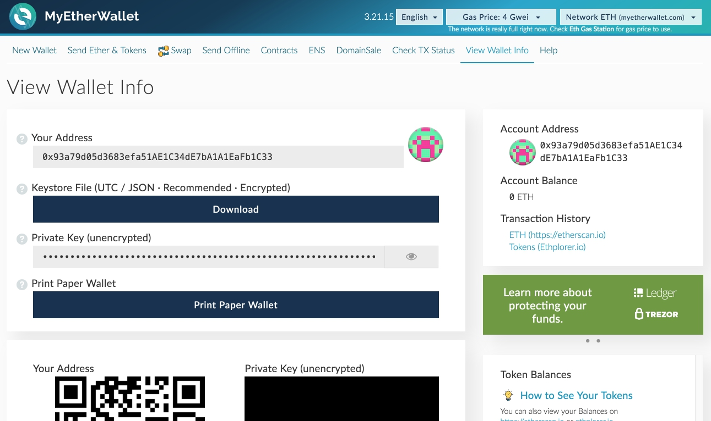

  
 

## Buying ethereum
To participate in the sale you will need an Ether (ETH).
You can purchase ETH using Visa or MasterCard bank cards through such services as:
* Changelly: https://changelly.com
* Cex.io: https://cex.io
* Coinbase https://www.coinbase.com

During the purchase you will need the wallet address created in the previous section.
All services have different commissions and different rates.
Make sure that the exchange rate suits you.

## Buying tokens
In order to buy tokens you need to send at least 0.1 ether to the wallet 0xaCF62c626904a17244cA6eEfd31Bf6Eb06895A82.
Before sending, make sure that:
1. You send at least 0.1 ETH (depending on the configuration of the sales contract, the value may be different. Look to minInvestedLimit at the corresponding contract).
2. The amount of gas is greater than 250 000
3. Gas price — at least 30 Gwei. Transactions with less gas price will take longer.

If you are using MyEtherWallet, you need to do the following:
1. Go to https://www.myetherwallet.com

2. Click "Send Ether & Tokens"
  

Screenshot

  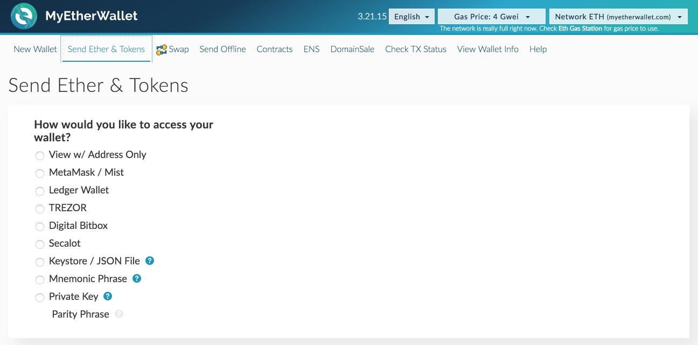

  
 

3. Select "Keystore / JSON File". Click "Select wallet file", enter password and click "Unlock".
  

Screenshot

  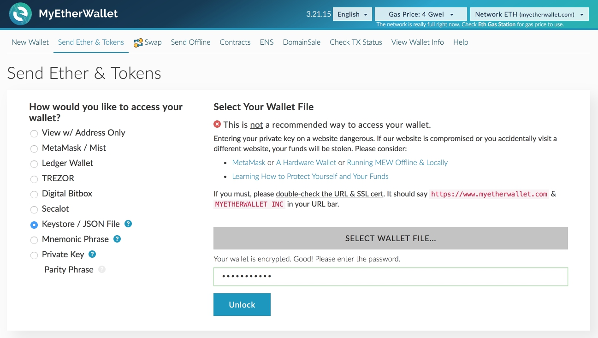

  
 

4. Enter 0xaCF62c626904a17244cA6eEfd31Bf6Eb06895A82 in the address field.  
Enter the amount of ether which you want to exchange to tokens.
  

Screenshot

  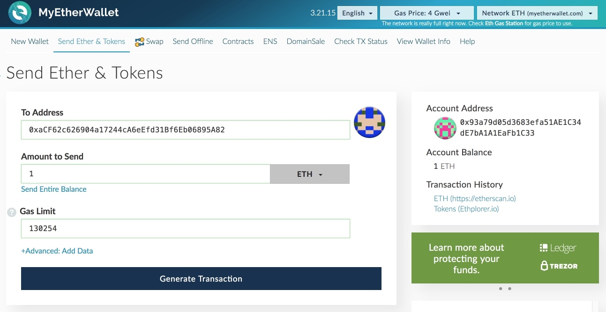

  
 

5. Click "Generate transaction", click "Send transaction".
  

Screenshot

  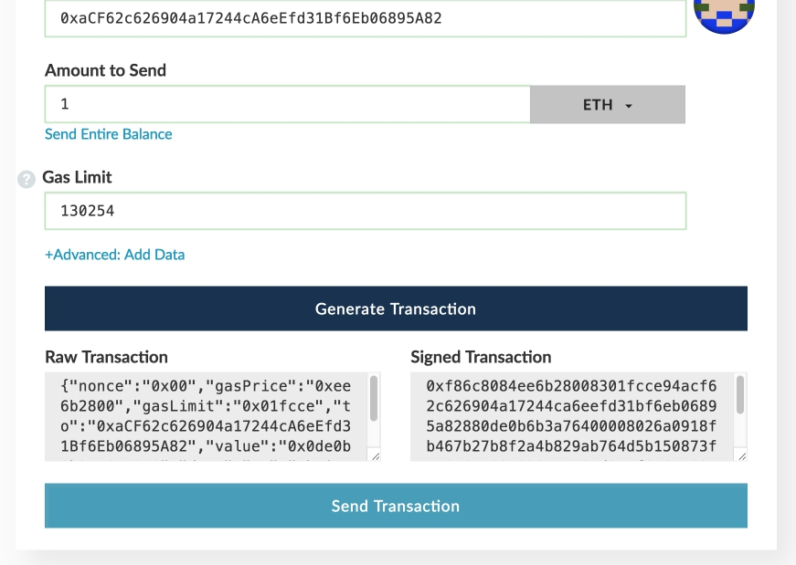

  
 

6. In the window that appears, click "Yes, I am sure! Send transaction".
  

Screenshot

  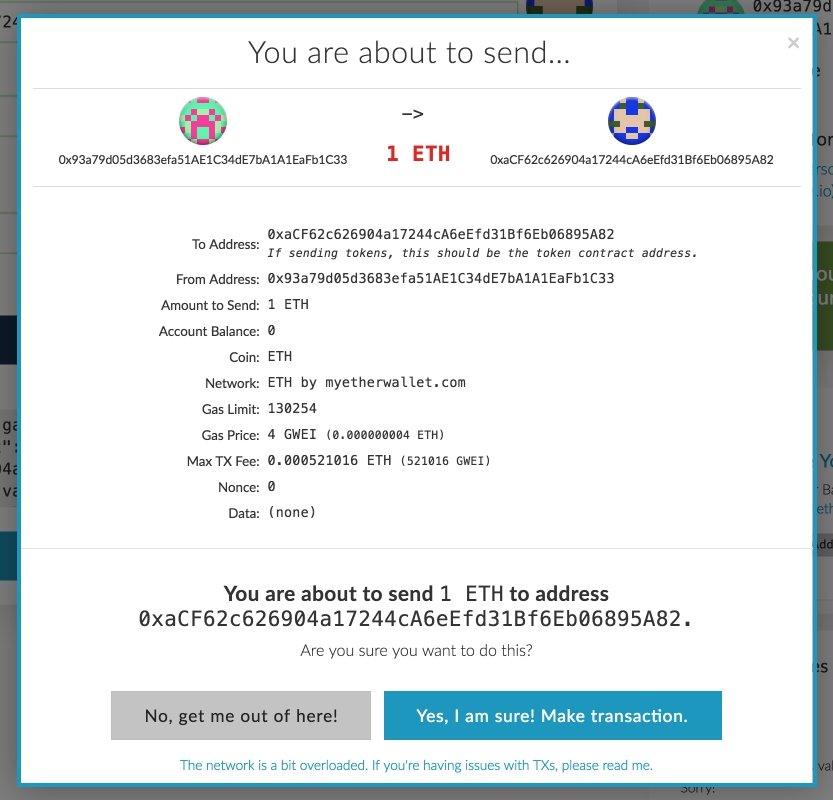

  
 

## Managing tokens
To add tokens to your wallet, you need the following information:
* Token Contract Address - 0x083802265C0585A788df3C890fbb17D5362502b2
* Token Symbol — GSE
* Decimals — 2

If you are using MyEtherWallet, you need to do the following:
1. Go to https://www.myetherwallet.com
2. Click "View Wallet Info"
  

Screenshot

  

  
 

3. Select "Keystore / JSON File", click "Select wallet file", enter password and click "Unlock".
  

Screenshot

  

  
 

4. In the right sidebar you will see "Token Balances" panel. Click "Add custom token".
  

Screenshot

  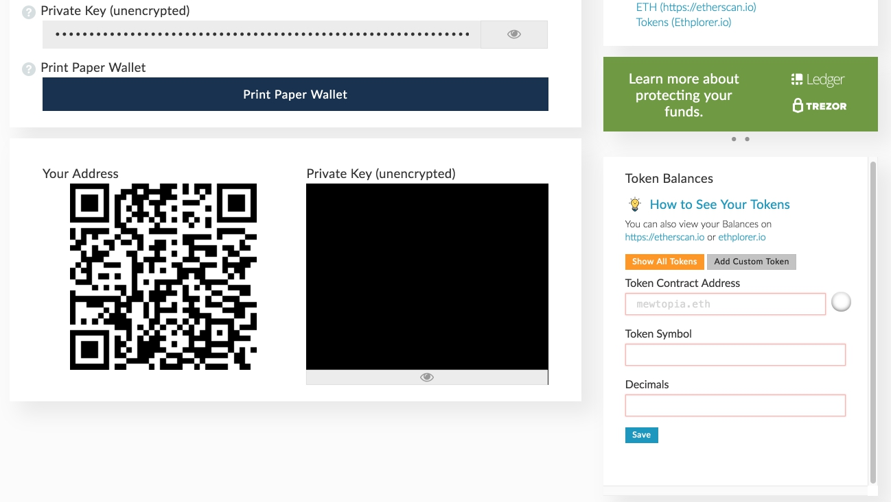

  
 

5. Enter token info and click "Save".
  

Screenshot

  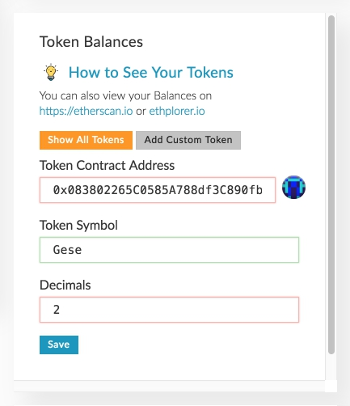

  
 
